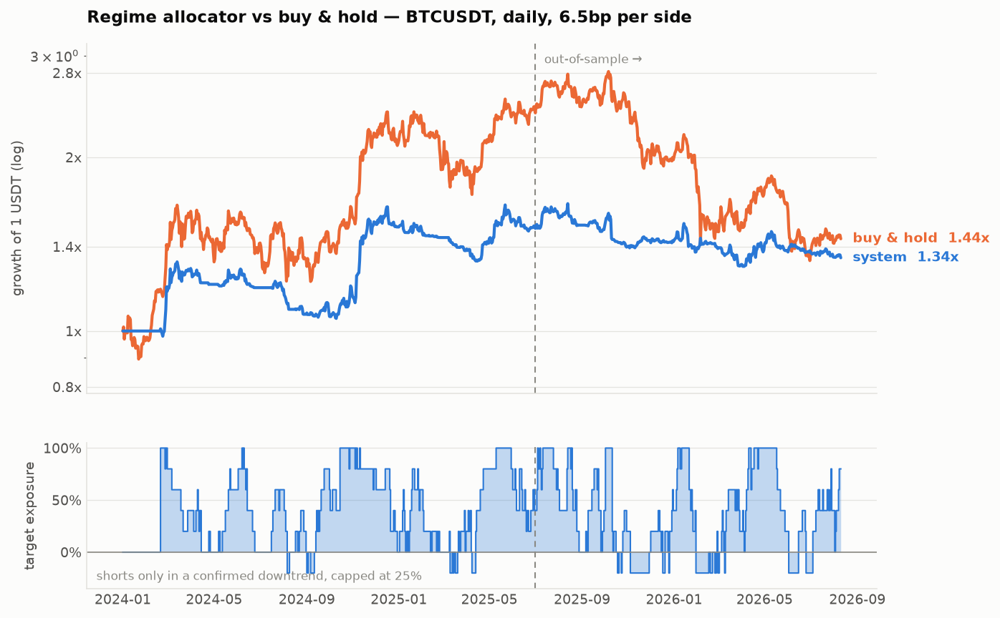

# BTCUSDT 区间型择时系统

基于 1H / 4H / 1D OHLC 数据的 BTCUSDT 自动交易研究框架，围绕 **Vortex Indicator (VI)** 展开，
最终落到一套**以 VI + DMI 投票 + 波动率标定**为核心的日线仓位分配系统。

两份报告：
- **[REPORT_VI_BAND.md](REPORT_VI_BAND.md)** — 对 [VI-Dashboard](https://github.com/worth0307-cmyk/vi-dashboard) 通道双突破打法（双突破上轨做空 / 加仓 / VI+ 回落止盈）的回测与诊断
- **[REPORT.md](REPORT.md)** — 从零构建日线择时系统的完整研究过程与全部证伪测试

---

## 数据源

**6 币种 × 3 周期，2023-01-01 起**（`data/{SYMBOL}_{1h,4h,1d}.csv`，共 11MB，已入库）：

| 币种 | 日线根数 | 起始 | 区间涨跌 | 最大回撤 |
|---|---|---|---|---|
| BTCUSDT | 1320 | 2023-01-01 | +283.7% | −53.0% |
| BNBUSDT | 1320 | 2023-01-01 | +148.1% | −58.2% |
| ETHUSDT | 1320 | 2023-01-01 | +57.1% | −67.6% |
| SOLUSDT | 1320 | 2023-01-01 | +658.3% | −76.3% |
| TAOUSDT | 854 | 2024-04-11 | −71.3% | −79.6% |
| HYPEUSDT | 440 | 2025-05-30 | +67.9% | −64.2% |

零缺口、零异常 OHLC；1h 重采样与 4h/1d 交叉校验通过；BTCUSDT 与最初上传的 2024 版在重叠区间逐字段一致。

## 关于 VI-Dashboard 通道打法的结论

1. **下轨从不触发，而这恰恰在帮你。** 1D 下轨 0.60 落在 VI+ 的 **0.7 分位**，两年半只触发 2 次。改成滚动自适应通道后下破触发 51 次，做多那半边活了过来——**然后 2026 年从 +7.2% 变成 −12.9%**。它靠着不触发替你挡掉了一条亏钱的多头。
2. **做空上破亏钱，这条被六币种坐实了。** BTC 单币 3.6 年：73 笔空单均值 −0.62%，**t=−2.36**，P(均值>0)=0.4%。六币池化 359 个事件，三种通道口径下 P(均值>0) 分别为 0.9% / 0.3% / 4.4%。
2b. **但"信号有预测力"我之前说过头了（已订正）。** 扣掉这段时间币圈本身的漂移后（随机开仓 48h 也有 +0.28%），超额只剩 +0.37%~+0.59%，**p=0.07~0.19，均不显著**。你亏钱主要不是信号在骗你，而是**在一个整体上涨的资产类别上做空**。
3. **但它在熊市里是对的**：事件后 2 天，2024 牛市 +2.05%(t=3.0)，2026 熊市 −1.34%(t=−2.1)。VI+ 是动量延续检测器，盈亏符号跟着大趋势走。
4. **逐笔胜率 53%、中位数 +0.04%，但均值 −0.59%** —— 平均亏损是平均盈利的 3.2 倍，最差一笔 −12.19%。用起来"感觉挺准"，死在尾部。
5. **加仓是最大的漏洞**：去掉加仓，亏损从 −30.1% 收窄到 −15.2%。VI+ 继续外扩 = 空单正在扩大亏损，此时加仓等于最糟时刻加倍下注。
6. **VI+ 的高低两端都是"动量延续"，不是"超买超卖"。** VI+ 高→继续涨，VI+ 低→继续跌（滚动通道下破后 +48h 为 −0.88%，n=51）。两边逆着做都是错的。
7. bootstrap：P(真实单笔均值 > 0) = **1.4%**。这是整份研究里唯一统计上站得住的结论。

8. **VI+ 真正测量的是波动，不是方向。** 事件后高低跨度是随机日期的 **1.10~1.30x（p<0.01）**，但 **|净收益| 只有 1.01x（不显著）**——价格走的路更长，终点却没更远。控制了波动率聚集（事后ATR÷事前ATR）后依然显著。
9. **但这个发现赚不到钱。** 拿它去给日线系统减仓，六币等权组合 Sharpe 在 x1/x0.9/x0.8/x0.5/x0 下全是 0.99，与基准差异 t=−0.6。效应量太小，且日线系统本就在做波动率标定。
10. **六个币其实只值 1.4 个币。** 平均两两相关 0.673，第一主成分占 73% 方差，有效独立标的数 = 1.37。事件还在时间上聚集（359 个事件只落在 93 个周）。按周聚类重做 bootstrap，做空上破的 P(均值>0) 从 0.3~0.9% 放宽到 **1.7~2.8%**——结论仍成立，但以聚类值为准。

详见 [REPORT_VI_BAND.md](REPORT_VI_BAND.md)。

## 三句话结论（另一条线：从零构建的日线系统）

1. **1 小时级别做不了。** 测过的每一个 1H 变体全部亏损（最差 −95.6%）——不是指标问题，是 13bp 往返成本占了 1H 中位振幅的 11%。
2. **单参数回测全是幻觉。** 日线 VI 仅多组合样本内平均 Sharpe +1.09，样本外 −0.74；而 VI(14) 那个漂亮的 1.06 是一根孤立尖刺，n=16 就掉到 0.25。
3. **真正稳的是"降暴露"。** 样本外那波 −50% 熊市里，所有家族、所有参数、100% 的格子都跑赢了拿现货。这不是 alpha，但它可复制。

## 系统表现（2024-01 ~ 2026-08，含 6.5bp/边成本）

| | 系统 | 拿现货 |
|---|---|---|
| 总收益 | +33.9% | +44.5% |
| 最大回撤 | **−22.1%** | −53.0% |
| Sharpe | 0.59 | 0.53 |
| Calmar | **0.53** | 0.29 |
| 2026 熊市 | **−6.2%** | −27.0% |

对现货 beta 0.29，年化 alpha +6.6%。
**但：t = 0.96，bootstrap Sharpe 90% 区间 [−0.59, +1.69]，deflated Sharpe 1.2%。**
超额收益在统计上未被证明——2.6 年数据证明 Sharpe 0.59 需要约 11.4 年。详见 REPORT.md 第 8 节。



## 多币种数据

框架已支持多币种（`data/{SYMBOL}_{1h,4h,1d}.csv`）。完整步骤见 **[RUNBOOK.md](RUNBOOK.md)**，摘要：

```bash
# VPS 上（Claude Code 会话的出口策略封了币安，必须在能访问币安的机器上跑）
ssh vpn-sg && cd ~/VI-Dashboard
for S in BTCUSDT BNBUSDT ETHUSDT HYPEUSDT SOLUSDT TAOUSDT; do
  python3 backend/tools/export_klines.py --symbol "$S" \
    --market futures --intervals 1h,4h,1d --start 2024-01-01 --out ./exports
done

# 本地
scp -r vpn-sg:~/VI-Dashboard/exports "$env:USERPROFILE\Desktop\VI数据"
python -m vibt.ingest "$env:USERPROFILE\Desktop\VI数据"
python scripts/12_multi_symbol.py
```

`ingest` 会逐币报告真实覆盖区间、缺口、异常 OHLC，并用 1h 重采样交叉校验 4h/1d。
HYPE/TAO 上市晚于 2024-01-01，历史会短一些，这是正常的——但要注意 HYPE 基本只覆盖了下跌段。

## 快速开始

```bash
pip install pandas numpy scipy matplotlib pytest
python -m pytest tests/ -q     # 11 个无前视偏差测试
python scripts/08_final.py     # 最终系统 + 全套验证
```

实盘信号（每天 UTC 00:00 / 北京 08:00 后跑）：

```bash
python -m vibt.fetch                        # 增量拉币安 K 线，公开接口无需 key
python -m vibt.live --equity 10000          # 打印目标仓位和下单计划
```

`vibt/live.py` 只输出下单计划，不替你发单。先纸上跑几个月再说。

## 目录结构

```
vibt/
  data.py         数据加载、多周期对齐（严格无前视）
  indicators.py   Vortex / DMI / ATR / Parkinson 波动率等，全部因果
  backtest.py     回测引擎：信号收盘产生、下一根开盘成交、成本按换手计
  metrics.py      绩效统计 + block bootstrap + deflated Sharpe
  strategies.py   信号库（VI 各变体、趋势、均值回归）
  system.py       最终系统（日线区间型投票 + 波动率标定）
  vi_band.py      VI-Dashboard 通道双突破策略（原版 / 反向 / 趋势定向 / 分位通道）
  live.py         实盘日线运行器
  fetch.py        币安 K 线增量拉取
scripts/          01~11，研究过程按顺序可复现
                  10~11 = VI-Dashboard 通道打法的事件研究与回测
tests/            无前视偏差与引擎正确性测试
reports/          图表与全部扫描结果 CSV
```

## 核心设计

```
目标仓位 = clip(看多票比 × 40% / 已实现波动率, 0, 1) − 确认空头 × 25% × 同一标定
```

- **12 票**：Vortex 和 DMI 各取 6 个 lookback（10/14/20/28/36/48）
- **只用高低点**：VI 和 DMI 由区间关系构成，日线上稳定优于收盘价均线（家族中位 Sharpe 0.49/0.64 vs EMA 0.20）
- **Parkinson 波动率**做仓位标定，比收盘价估计效率高约 5 倍
- **空头是保险不是 alpha**：整体拉低 Sharpe，但把熊市亏损从 −15.4% 收窄到 −11.5%
- **仓位按 20% 网格取整**，避免噪声换手。年换手 24.7 倍，年化成本拖累 1.60%

## 免责声明

研究代码，非投资建议。回测不包含永续资金费率、交易所故障、极端滑点。
按报告中的置信区间，未来 12 个月跑输拿现货是完全可能的结果之一。
