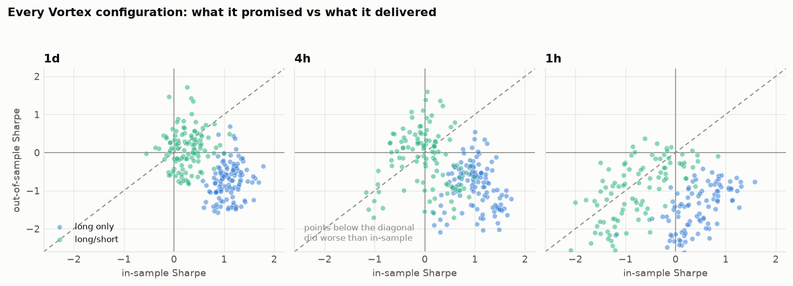
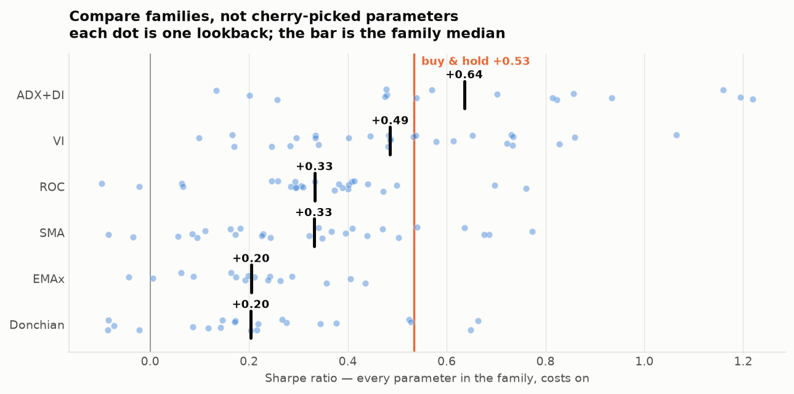
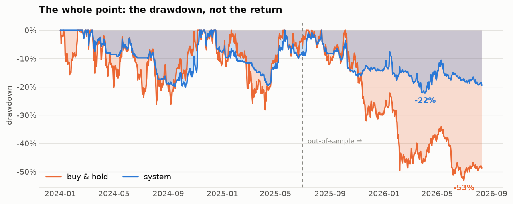

# BTCUSDT 自动交易系统 — 研究报告

数据：2024-01-01 ~ 2026-08-12，BTCUSDT 的 1H / 4H / 1D OHLC（无成交量）。
成本假设：每边 4.5bp 手续费 + 2bp 滑点 = 单次往返 13bp（币安 U 本位永续 VIP0 taker 的现实水平）。
执行假设：**信号在 K 线收盘产生，下一根 K 线开盘成交**。回测引擎自己做这个位移，策略代码不允许前移。

---

## 0. 先说结论

先把话说在前面，因为后面全是支撑它的证据：

1. **VI 的方向不是在"预测"，而是在"分类"。** 它在日线上确实有效，但价值不在于抓涨跌，而在于把行情分成"该拿仓"和"该躺平"两类。
2. **在 1 小时级别上，你的这套想法一定亏钱**，而且和 VI 无关——是成本结构决定的。测试的每一个 1H 变体全部亏损，最差的 −95.6%。
3. **单个参数（比如 VI(14)）的漂亮回测是假象。** 日线 VI 长仓组合的样本内平均 Sharpe 是 +1.09，样本外掉到 **−0.74**；112 个参数格子里只有 4% 在样本外为正。
4. **但"随便挑一个趋势过滤器"这件事本身是稳的。** 在 2025-07 之后那波 −50% 的熊市里，**所有家族、所有参数、100% 的格子都跑赢了拿现货**。这才是真正可复制的东西。
5. **基于区间（高低点）的指标——VI 和 DMI——在日线上稳定优于基于收盘价的均线类**。这一条部分印证了你的直觉。
6. 最终系统：Sharpe 0.59 / 最大回撤 −22.1%，对比拿现货 Sharpe 0.53 / 回撤 −53.0%。**它是一台"降 Beta 的机器"（beta 0.29），年化超额约 +6.6%，但这个超额在统计上没有被证明。**

最后一条最重要，第 8 节会把它拆开讲。

---

## 1. 数据体检

| 周期 | 根数 | 区间（UTC） | 缺口 |
|---|---|---|---|
| 1H | 22,906 | 2023-12-31 16:00 → 2026-08-12 01:00 | 0 |
| 4H | 5,726 | 同上 | 0 |
| 1D | 954 | 2024-01-01 → 2026-08-11 | 0 |

数据很干净。北京时间标注的是 K 线**开盘**时刻，因为 8 是 4 的倍数，4H/1D 的网格和币安 UTC 网格完全重合（日线 = UTC 自然日）。用 1H 重采样去校验 4H/1D：日线 4 个字段完全一致（误差 0），4H 的 open/low 有约 1e-3 量级的极小差异——可以忽略，但说明两个文件不是同一次导出的。

**样本本身的质量非常好**，因为它包含了一个完整的循环：

| 年份 | 收益 | 年化波动 | 最大回撤 |
|---|---|---|---|
| 2024 | **+121.1%** | 53.1% | −26.3% |
| 2025 | −6.4% | 41.8% | −32.0% |
| 2026 (至 8 月) | **−27.4%** | 45.8% | −39.5% |

区间高点 126,208（2025-10-06），当前 63,572。拿现货全程 +44.5%，**最大回撤 −53.0%**。
一个策略要是能在这三种截然不同的环境里都站得住，那才值得看。

### 一个不受欢迎但很关键的统计

日线对数收益的**方差比（Variance Ratio）**：

```
k= 2: VR=0.955    k= 3: VR=0.825    k= 5: VR=0.900
k=10: VR=0.912    k=20: VR=0.906
```

**全部小于 1。** VR < 1 意味着这段样本里的 BTC 是**轻微均值回归**的，不是趋势的。日线 1 阶自相关 −0.058 也指向同一个方向。

这直接解释了后面为什么经典趋势策略（Donchian 突破、TSMOM、均线交叉）在日线上大面积亏损——它们赌的是 VR > 1。

---

## 2. VI 到底有没有信息？

在写任何策略之前，先只看**条件化的未来收益**：不带成本、不带止损、不做优化。如果这里没有边际，后面加再多止损也变不出来。

### 日线（有信息，但很弱）

| VI(14) 状态 | 样本数 | 未来 1 日 | 未来 10 日 |
|---|---|---|---|
| VI+ > VI− | 500 | **+0.188%** (t=1.8) | **+1.197%** (t=3.5) |
| VI+ < VI− | 440 | −0.058% (t=−0.5) | +0.249% (t=0.7) |

分层看更清楚，VI 价差最高的那 20%（Q5）未来 10 日 **+2.618% (t=4.1)**，最低的 20%（Q1）是 −0.741%。但中间三档不单调，说明信息集中在两个极端。

Spearman IC 只有 0.02~0.07，**t 值基本都够不到 2**。所以：有方向性，但离"显著"很远。

另外一个有意思的点：**日线的死叉（bear cross）next-day 平均 −1.105%，t = −3.7**（49 次）。金叉则几乎没有信息（+0.009%）。信号是**不对称**的——向下的穿越比向上的穿越有用得多。

### 4H（几乎没有）

所有 lookback、所有前瞻期的 IC 全是负的且不显著。VI+ > VI− 状态的未来 30 根收益 +0.437% (t=4.6) 看着不错，但那主要是样本漂移（buy&hold 本身就在涨）造成的混淆。

### 1H（有统计显著性，但方向是反的）

```
signal              h1               h4              h12
ROC(14)          -0.0284(t -4.3)  -0.0290(t -4.4)  -0.0278(t -4.2)
close/EMA50-1    -0.0326(t -4.9)  -0.0405(t -6.1)  -0.0340(t -5.1)
RSI(14)-50       -0.0380(t -5.8)  -0.0361(t -5.5)  -0.0221(t -3.3)
VI spread (n=21) -0.0236(t -3.6)  -0.0421(t -6.4)  -0.0350(t -5.3)
```

**所有动量类信号在 1H 上的 IC 都是负的，t 值 −4 到 −6，高度显著。** 也就是说 1 小时级别的 BTC 是**均值回归**的，顺势做只会被反复打脸。

但请注意——**统计显著 ≠ 能赚钱**。IC 只有 0.04，分层价差不到 3bp，而你的往返成本是 13bp。这就是下一节。

---

## 3. 为什么 1H 一定亏 —— 先算账，再谈策略

| 周期 | K 线中位振幅 | 13bp 往返成本占振幅比例 |
|---|---|---|
| 1H | 0.547% | **11.0%** |
| 4H | 1.165% | 5.1% |
| 1D | 3.312% | 1.8% |

在 1H 上，你每做一笔交易，就先付掉这根 K 线全部振幅的 11%。VI(14) 多空在 1H 上换手 2,471 次 × 13bp = **321% 的本金被手续费吃掉**。

实测（1H，全部亏损）：

| 策略 | 收益 | Sharpe | 最大回撤 | 交易次数 |
|---|---|---|---|---|
| VI(14) 多空 | **−95.6%** | −2.26 | −95.8% | 2,471 |
| VI(14) 仅多 | −69.7% | −1.25 | −74.7% | 1,235 |
| VI(14) 反向（吃均值回归） | −91.8% | −2.92 | −92.1% | 1,724 |
| Donchian 20/10 | −88.1% | −1.50 | −89.3% | 1,056 |
| 1H 全部 22 个变体 | 无一为正 | | | |

**注意第三行**：即使按第 2 节发现的"正确方向"（反向做）去交易 1H，照样亏 91.8%。统计边际是真的，但它比成本小一个数量级。

> 这条结论跟指标无关，跟你的 VI 想法也无关。它只是算术。
> **如果你打算做 1H，唯一的出路是挂单吃返佣做 maker，把成本压到接近 0，那是另一个游戏（做市），不是这个游戏。**

---

## 4. 参数是噪声 —— 最该看的一张图

把 VI 在三个周期上各扫 224 个配置（lookback 6~60、多空/仅多、滞回带 0~0.06），
样本内 = 2024-01 ~ 2025-06，样本外 = 2025-07 ~ 2026-08（正好覆盖 10 月见顶 + 整个熊市）：

| 周期 | 模式 | 样本内平均 Sharpe | 样本外平均 Sharpe | 样本外为正的格子 |
|---|---|---|---|---|
| 1D | 仅多 | **+1.09** | **−0.74** | 4% |
| 1D | 多空 | +0.25 | +0.10 | 57% |
| 4H | 仅多 | +1.02 | −0.87 | 6% |
| 1H | 仅多 | +0.31 | −1.73 | 0% |

样本内最好的那格（1D，n=14，仅多，Sharpe 1.78）——也就是**你实际会拿去交易的那一格**——样本外是 **−0.36**。

日线 VI 的邻域敏感性同样刺眼（仅多，全样本 Sharpe）：

```
n=10 → 0.40    n=12 → 0.48    n=14 → 1.06    n=16 → 0.25    n=18 → 0.53
```

**n=14 是一根孤立的尖刺。** 真实的边际不会因为你把回看期从 14 改成 16 就消失。所以 VI(14) 的那个 1.06 是运气，不是发现。



---

## 5. 但样本外的"崩塌"要读对

上面那张表有个陷阱：**样本外是一段 −50% 的熊市，一个"仅多"策略在里面必然亏钱，Sharpe 必然为负。** 拿它跟 0 比不公平。

正确的基准是**拿现货**：

| | 全样本 | 样本内 | 样本外 |
|---|---|---|---|
| 拿现货 | +44.5%，Sharpe 0.53 | +142.0%，Sharpe 1.41 | **−39.4%，Sharpe −0.87** |
| VI(14) 仅多 | +111.1%，Sharpe 1.06 | +139.2% | **−10.5%**，回撤 −24.3%（现货 −53.0%） |

换个角度：VI(14) 仅多在熊市里**只亏了拿现货的四分之一**。上行捕获 51.4%，下行捕获 44.8%。

于是真正稳的那条结论浮出来了：

> **在样本外那波熊市里，我测过的每一个家族、每一个参数、100% 的格子，都跑赢了拿现货。**

这不是 alpha，这是**降低暴露**。但它可复制、不依赖调参、而且在 BTC 这种回撤 −53% 的资产上，价值非常实在。

---

## 6. 家族对决 —— VI 确实比均线好

拿单个 VI(14) 去比单个 EMA(50,200) 是自欺欺人。公平的比法是：**每个家族各自扫完整个参数网格，比中位数。**

日线、仅多、含成本：

| 家族 | 中位 Sharpe | 中位回撤 | 跑赢现货 Sharpe 的比例 |
|---|---|---|---|
| **ADX/DI**（方向性动量） | **+0.64** | −32.4% | **62%** |
| **VI**（涡旋） | **+0.49** | −35.3% | 41% |
| ROC | +0.33 | −30.6% | 8% |
| SMA | +0.33 | −30.4% | 19% |
| EMA 交叉 | +0.20 | −33.3% | **0%** |
| Donchian | +0.20 | −33.5% | 10% |
| *拿现货* | *+0.53* | *−53.0%* | — |



排名前二的 VI 和 DMI **有一个共同点：它们都由"高低点之间的关系"构成，而不是收盘价的平均**。

- VI+ = Σ|High_t − Low_{t−1}| / ΣTR
- DI+ = Σ max(High_t − High_{t−1}, 0) / ...

而排在后面的 SMA / EMA / ROC 全部只用收盘价。

这是一个**有物理解释的结论**：BTC 是 24 小时、无涨跌停、经常插针的市场，收盘价只是一个采样点，而高低点携带了那根 K 线内部的全部争夺信息。**你对 VI 的直觉方向是对的**——只是原因和大多数人以为的不一样。

（ADX/DI 比 VI 还好一点。我把两者都放进最终系统了。）

---

## 7. 最终系统的设计逻辑

每一条都来自上面的实证，不是拍脑袋：

| 设计决定 | 依据 |
|---|---|
| **只在日线做决策** | 1H 全灭（§3）；4H 换手翻倍、边际减半 |
| **不押注单一参数**，对 6 个 lookback（10/14/20/28/36/48）投票 | n=14 是孤立尖刺（§4） |
| **只用区间型指标**（Vortex + DMI），共 12 票 | 区间型家族中位数完胜收盘型（§6） |
| **仓位 = 看多票数比例 × 波动率标定**，按 20% 网格取整 | 波动标定让 27 个 lookback 的**中位** Sharpe 和**中位**回撤同时改善——中位数上成立的改进，比只在最优格上成立的可信得多 |
| **空头只在"确认下跌"（12 票全空 + 收盘 < SMA200）时开，且只开 25%** | 空头整体拉低 Sharpe（0.66→0.59），但把熊市亏损从 −15.4% 收窄到 −11.5%。它是**保险，不是 alpha** |

目标仓位 = clip(看多票比 × 40%/已实现波动率, 0, 1) − 确认空头 × 0.25 × 同一标定

波动率用 **Parkinson 估计量**（基于高低点），比收盘价估计效率高约 5 倍——又是同一个道理。

### 结果

| | 系统 | 拿现货 |
|---|---|---|
| 总收益 | +33.9% | +44.5% |
| CAGR | +11.8% | +15.1% |
| 年化波动 | **23.4%** | 47.3% |
| **最大回撤** | **−22.1%** | **−53.0%** |
| Sharpe | 0.59 | 0.53 |
| **Calmar** | **0.53** | 0.29 |
| 交易次数 | 54（2.6 年） | 1 |
| 平均仓位 | 38.3% | 100% |

分年度：

| | 系统 | 拿现货 |
|---|---|---|
| 2024（牛） | +51.4%（回撤 −20.2%） | **+111.4%**（回撤 −26.3%） |
| 2025（震荡） | −5.7%（−16.2%） | −6.4%（−32.0%） |
| 2026（熊） | **−6.2%**（−15.7%） | −27.0%（−39.5%） |




**它牺牲牛市涨幅（2024 只吃到一半），换取熊市保护（2026 只亏 1/4）。** 拆解一下就是：

```
对现货的 beta      0.29
日收益相关性       0.586
年化 alpha        +6.57%     ← 但见下一节
```

**它本质上是一台"把 BTC 的 beta 降到 0.29、外加约 6.6%/年 alpha"的机器。**

---

## 8. 这套东西有多可信？（诚实的部分）

我把所有能想到的证伪测试都跑了。结果好坏参半，我按原样列出来。

### 通过的测试

| 测试 | 结果 |
|---|---|
| **风险参数扰动**（45 组：目标波动 × 空头比例 × 波动回看） | Sharpe 中位 +0.56，最差 +0.42；**100% 的组合回撤优于现货**，67% 的 Sharpe 优于现货 |
| **投票集合扰动**（60 组随机抽取的 lookback 集合） | Sharpe 中位 +0.46，**98% 为正** |
| **成本压力测试** | 0bp → 0.66；6.5bp → **0.59**；12.5bp → 0.53；30bp → 0.35。年化成本拖累仅 **1.60%** |
| **无前视检验**（11 个自动化测试） | 全部通过，包括：截断未来数据不改变任何历史指标值、引擎强制执行 1 根 K 线延迟、"作弊信号"能被检出（Sharpe > 10） |

低换手（年换手 24.7 倍）意味着这套东西对成本、对滑点、对执行质量都不敏感。这是好设计的标志。

### 没通过的测试

| 测试 | 结果 |
|---|---|
| **t 统计量** | **+0.96**（需要 ≈2.0 才算 95% 置信） |
| **Block bootstrap 的 Sharpe 90% 置信区间** | **[−0.59, +1.69]** —— 舒舒服服地包含 0 |
| **Deflated Sharpe**（整个研究扫过约 908 个配置） | **1.2%**（需要 >95%）。即使是全场最优的 DI(36)（Sharpe 1.22），单独算也只有 25.7% |
| **随机信号对照**（把同一个信号做 500 次循环平移，保持换手和平均仓位不变） | 对照组 Sharpe 中位 +0.24、p95 +0.95；真实系统 +0.59，只排在 **78.2 百分位**。也就是说，**同样的仓位曲线随便挪个位置，有 22% 的概率比真系统还好** |
| **执行延迟敏感性** | +0d：0.59 / +1d：0.40 / +2d：0.34 / **+3d：0.70**。**非单调** —— 延迟 3 天反而更好，说明择时精度是噪声 |
| **走向前测试（滚动优化目标波动率）** | Sharpe 从 0.59 **掉到 0.26**。**自适应调参会毁掉价值** |

### 这些数字合起来说明什么

**能确立的：**
- 降低 beta、削掉一半以上回撤 —— 这个是**结构性**的，在所有家族、所有参数上都成立，不依赖任何一次拟合。
- 区间型指标 > 收盘型指标 —— 家族中位数层面的差异，比较扎实。
- 高频必死 —— 算术，不用统计。

**不能确立的：**
- 那 +6.6%/年的 alpha。它可能是真的，也可能是 2.6 年样本 + 908 次尝试的产物。**要在 95% 置信度上证明 Sharpe 0.59，需要约 11.4 年数据。我们有 2.6 年。**

> 任何人（包括我）拿 2.6 年 OHLC 跟你说"我找到了一套稳定盈利的 BTC 逻辑"，都应该被怀疑。
> 我能给你的是：**一套稳健的风险管理框架 + 一个诚实标注了置信度的边际。**

---

## 9. 怎么用

```bash
pip install pandas numpy scipy matplotlib pytest

python -m pytest tests/ -q        # 先确认引擎没有前视偏差
python scripts/01_survey.py       # 数据体检 + 市场结构
python scripts/02_vi_diagnostics.py   # VI 有没有信息
python scripts/03_baselines.py    # 各策略基准对比
python scripts/04_robustness.py   # 参数稳健性 / 样本外崩塌
python scripts/05_vs_benchmark.py # 相对现货 + 走向前
python scripts/06_design.py       # 成分消融
python scripts/07_families.py     # 家族对决
python scripts/08_final.py        # 最终系统全套验证
python scripts/09_charts.py       # 出图
```

实盘（日线，每天 UTC 00:00 / 北京 08:00 后跑一次）：

```bash
python -m vibt.fetch                          # 增量拉取币安 K 线（公开接口，无需 API key）
python -m vibt.live --equity 10000            # 打印今日目标仓位和下单计划
python -m vibt.live --equity 10000 --paper    # 同上，并把模拟成交写进 state.json
```

`vibt/live.py` **故意停在"下单计划"这一步**，不替你发单。接自己的交易所、自己的风控、自己的 key。
建议先纸上跑 2~3 个月，把 `state.json` 的曲线和回测对一遍，再考虑上真金。

当前状态（2026-08-11 收盘）：12 票中 7 票看多，已实现波动 28.5%（低于 40% 目标，标定 = 1.0），**目标仓位 60%**。

---

## 10. 我会往哪个方向继续找

按我认为的期望价值排序：

1. **拿更长的历史。** 2.6 年是这份研究最大的硬约束。有 2017 年起的数据，上面所有结论的置信度都会完全不同。这一步的价值大于任何调参。
2. **加入 OHLC 以外的信息。** 现在这份数据里没有成交量、没有资金费率、没有持仓量、没有链上数据。**永续合约的资金费率**在我看来是最值得加的一个——它直接测量杠杆多头的拥挤度，和价格信息是正交的，而且免费。
3. **横向扩展到多币种。** 同一套逻辑同时跑 BTC/ETH/SOL 等，用组合分散把 t 值做上去。单资产 2.6 年永远打不到统计显著，10 个资产就有机会。
4. **1H 数据的正确用法不是拿来发信号，而是拿来执行。** 日线出信号，在接下来 24 小时里用 1H 找个好点位分批进出，可以省下几个 bp 的冲击成本。
5. **别做的事**：继续在这 2.6 年里调参。第 8 节的走向前测试已经证明了，自适应调参在这个样本量上是负价值。

---

## 11. 风险声明

这是研究代码，不是投资建议。回测里的每一个数字都建立在"历史会重演"这个不成立的假设上。真实交易还会遇到回测里没有的东西：交易所宕机、永续合约的资金费率（本报告默认设为 0）、极端行情下的滑点放大、强平、以及你自己在连亏三个月时会不会关掉它。

按第 8 节的置信区间，这套系统未来 12 个月跑输拿现货是完全可能的结果之一。
